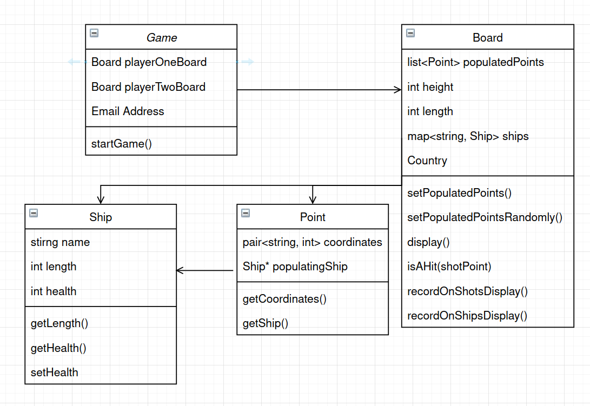

# AdaShip
## 1. Challenge Outline

### a) Summary and review of the problem,

I was tasked with creating a version of Battleship for my university. They reqeusted that the size of the map, the amount of boats (including their lengths and names), be read from a file and used to set up the game.

The requriements included making it possible for the player to play agaisnt the computer but also against another person. Further, 2 additional modes were to be implemented: 
* Salvo mode where a player can shoot as many times as she has ships alive
* Mines mode where 5 mines are randomly placed on the map and when hit, damage any ships around them.

I designed the architecture with these requriements in mind. This lead me to the folowing key decisisons:
*  Create a configurationReader to get the data from the file.
*  Create a Menu class to get user game type and mode choices
*  Make the Game object constructor take fileConfiguration and userConfiguration structures to set up the game correctly
*  Give the Board class a list of populated points to ease with AI implementation
*  Give Ship objects a health property so I can tell when one is sunk.

### b) UML class dependency diagram

### c)  Development strategy and approach to quality
I used an Agile strategy for this project. Before beginning development, i made a class dependency diagram based on the requriements. Once the first iteration was compleate, I adjusted the diagram and did another iteration. This helped me ensure i'm meeting the current requriement and to plan ahead so I dont end up in a situation where the architecture of the program prevents me from meeting requirements i had yet to tackle.

Another way I ensured the high quality of the solution is by testing the code and looking for edge cases. This helped me find bugs early and fix them before the codebase grew and made this harder.

### d) and Problem decomposition
I broke down the problem into epics, and stories. I had 6 epics:
* Read data from file and get user game configuration data
  - create configurationReader class
  - create menu to take input 
* Create Classes
  - Ship
  - Point
  - Board
  - Game
* Allow for boat placement on the Board
  - Manual
  - Random placement for AI
* Turn taking
  - Shooting
    - Manual shooting
    - AI shooting
  - Determining winner
* Salvo mode (simple)
  - Determining amout of shots for player
* Mines
  - Mine creation
  - Mine explosion

By breaking the problem down i was able to structure the development so that functions I make in current stories would be useufl in the next ones.

It was key to split the problem in this way as it let me build upon my previous work by coordinating development tasks.

###  e) Object dependency plan
Looking at the dependency diagram shows you how I planned the development. First i craeted the Ship class and then ensure the configurationReader correctly initialises the Ship objects.

Next I created the Point class and tested it too.

Now I was able to make the Board which depends on the existance of Points. Here i implemented only the basic functions and in later iterations I added other functions to it.

Finally, I could create the Game class and begin working on boat placement. 

## 2. Development

### a) Use of good standards
When developing the code i followed some common best practises. 
First, all classes were split in public and private sections. This ensures security though only allowing the user of those classes to use the functions provided to them and by not letting them mutate variables directly.
The way i implemented mutation is thorugh setter methods. This secures the values from being changed unexpectedly and introducing hard to debug issues.

Second, I extracted any functionality which was repeated in other parts of the code. This means that the codebase is smaller, faster to compile and simpler to read and understand. 

In order to reduce the likelehood of bug introduction, I ensured that a function's names exactly represents what the function does. Likelwise, i named all variables with similar consideration.

Another example of folowing good standards is how in many functions i pass pointers, making the code run faster as objects are not coppied, but instead only a pointer to the object in question is used.

### b) Phase 1 - configuration data gathering
In phase 1 I get all the configuration the game needs. 
 * First, I implemented the fileConfiguration reader which extracts data from the .ini file and structures is it can be used later by the Game object.
 * Second, I introdduced a menu which gets configuration data from the user and stores it in a datastructure similar to the one from the fileConfiguration reader.

### c) Phase 2 - class creation
In this plase I created all the calsses, following the dependency plan outlined above. Having a plan made the process faster, requeriing less refactoring, and the code clear of smells.

### d) Phase 3 - ship placement
Here I implemented the private initialiseShips() and initialiseShipsRandomly() functions in the Game class.
  * while Making initialiseShips() i used regex to validate input of coordinates. Using regex instead of implementing my own parser was both more time efficient and also made the code simpler. Since advanced programmers know how to use regex it made the code easier to read and logic about compared to a custom implemntation of a parser.
  * for initialiseShipsRandomly() i seeded the rand() function so ship position will be different each time. Here regex was not needed which made the random placement faster.

### e) Phase 4 - turn taking
Phase 4 involved creating a loop which the progarm only exits if a player has won.
  * Turn taking was implemented through using a boolean to check which play's turn it currently is. 
  * Determining winner was done by creating a function to count alive ships for a given board. If a player had 0 alive ships, they lost.
  The planning in past itterations was useful as the Ship class was specifically designed with this situation in mind. In the Ship calss definition, each ship's initial health is set to its length. This early decission made the development of the current stage faster.
  * The shooting function took advantage of planning in stage 1 b) and d) as i had predicted the need to know which points are populated by ships. The function getPopulatedPoints() implmeneted by the Board class was useful as i could check against the populatedPoints to see if the player had hit a ship.

### f) Phase 5 - Salvo mode
The key challenge in this stage was checking how many times a player should be alowed to shoot. 
 * I check how many times a player can shoot by using the same function i used in phase 4 to check how many alive ships a player has. In this situation, the task decomposition stage payed off as I could use functions made in previous itterations to accomplish the current task faster.  
### g) Phase 6 - Mines
Finally, stage 6 involved generating mine locations and exploding them if hit as well as checking if any ships were hit by the explosion
  * To implement this i generated the mine locations and every time the player took a shot, ran a check if a mine was hit.
  * Once again, the problem decomposition stage came usueful as i could use the previously made shooting function on any point that the explosion from a mine would hit.

### h) Testing and resolving bugs
Many bugs were encountered in the process of development. This is why I used an the CLion IDE. It provided me with a very highly developed debugger which let me follow the flow of the program and analyse what caused my bugs.

One way i tested my code was by printing information on the screen to show me useful information, such as Ship health, which is not normally visible. 

I was very defencive when creating each phase, ensuring only validated and expected output would come out of each phase. This let me conmpartmentalise bugs so if one was found I would not have to change any code in previous phases to fix it. Throuh using a best practise of returning values from functions rather than mutating global variables I prevented hard to analyse bugs from appearing and made my code safer to use and improve on in the future.

### i) Reflection on key design challenges and how i solved them