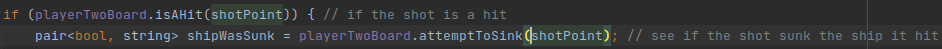
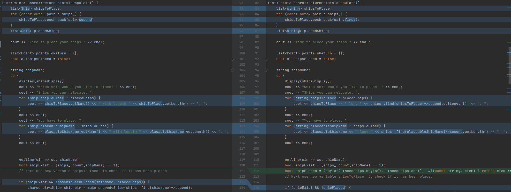
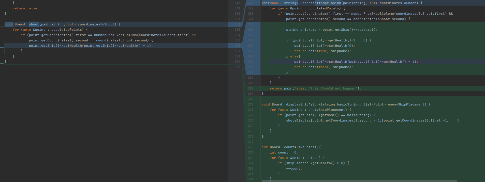
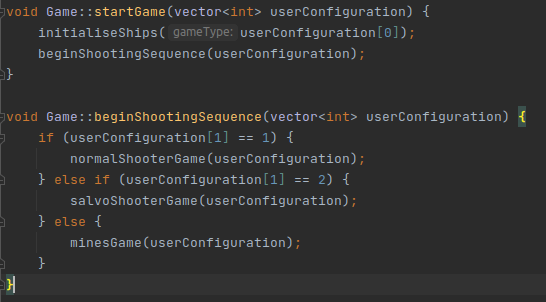
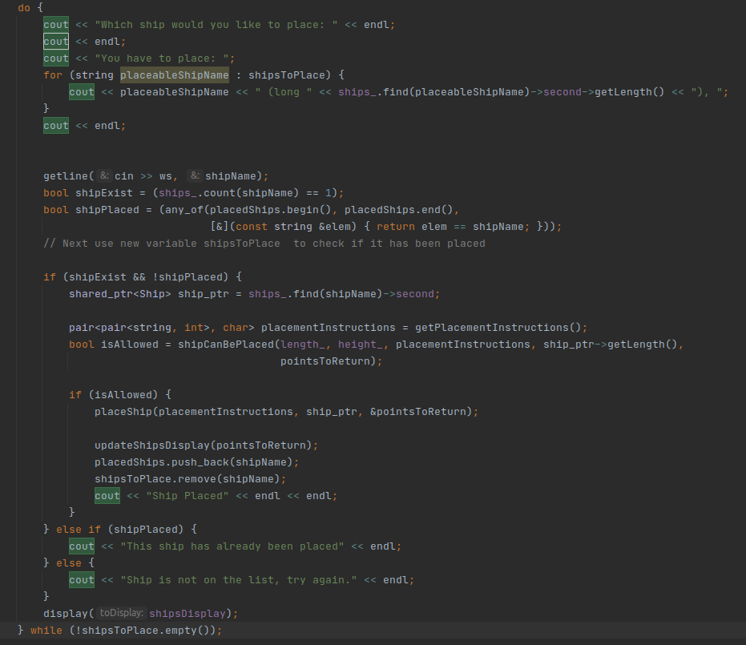

# AdaShip
## 1. Challenge Outline

### a) Summary and review of the problem,

I was tasked with creating a version of Battleship for my university. They requested that the size of the map, the amount of boats (including their lengths and names), be read from a file and used to set up the game.

The requirements included, making it possible for the player to play against the computer but also against another person. Further, 2 additional modes were to be implemented: 
* Salvo mode where a player can shoot as many times as she has ships alive
* Mines mode where 5 mines are randomly placed on the map and when hit, damage any ships around them.

I designed the architecture with these requirements in mind. This lead me to the following key decisions:
* Create a configuration reader to get the data from the file.
* Create a menu class to get user game type and mode choices
* Make the Game object constructor take file configuration and user configuration structures to set up the game correctly
* Give the Board class a list of populated points to ease with AI implementation
* Give Ship objects a health property so I can tell when one is sunk.

### b) UML class dependency diagram

### c) Development strategy and approach to quality
I used an Agile strategy for this project. Before beginning development, i made a class dependency diagram based on the requriements. Once the first iteration was compleate, I adjusted the diagram and did another iteration. This helped me ensure i'm meeting the current requriement and to plan ahead so I dont end up in a situation where the architecture of the program prevents me from meeting requirements i had yet to tackle.

Another way I ensured the high quality of the solution is by testing the code and looking for edge cases. This helped me find bugs early and fix them before the codebase grew and made this harder.

### d) Problem decomposition
I broke down the problem into epics, and stories. I had 6 epics:
* Read data from file and get user game configuration data
  - create configuration reader class
  - create menu to take input 
* Create Classes
  - Ship
  - Point
  - Board
  - Game
* Allow for boat placement on the Board
  - Manual
  - Random placement for AI
* Turn taking
  - Shooting
  - Manual shooting
  - AI shooting
  - Determining winner
* Salvo mode (simple)
  - Determining amount of shots for player
* Mines
  - Mine creation
  - Mine explosion

By breaking the problem down i was able to structure the development so that functions I make in current stories would be useful in later ones.

It was key to split the problem in this way as it would let me build upon my previous work by coordinating development tasks.

### e) Object dependency plan
Looking at the dependency diagram shows you how I planned the development. First i created the ship class and then ensured the configuration reader correctly initializes the Ship objects.

Next I created the Point class and tested it too.

Now I was able to make the Board which depends on the existence of Points. Here i implemented only the basic functions and in later iterations I added other functions to it.

Finally, I could create the Game class and begin working on ship placement. 

## 2. Development

### a) Use of good standards
When developing the code i followed some common best practices. 
First, all classes were split in public and private sections. This ensures security though only allowing the user of those classes to use the functions provided to them and by not letting them mutate variables directly.
The way i implemented mutation is through setter methods. This secures the values from being changed unexpectedly and introducing hard to debug issues.

Second, I extracted any functionality which was repeated in other parts of the code. This means that the codebase is smaller, faster to compile and simpler to read and understand. 

In order to reduce the likelihood of bug introduction, I ensured that a function's names exactly represents what the function does. Likewise, i named all variables with similar consideration.

Another example of following good standards is how in many functions i pass pointers, making the code run faster as objects are not copied, but instead only a pointer to the object in question is used.

### b) Phase 1 - configuration data gathering
In phase 1 I get all the configuration the game needs. 
* First, I implemented the file configuration reader which extracts data from the .ini file and structures it so it can be later used by the Game object.
* Second, I introduced a menu which gets configuration data from the user and stores it in a data structure similar to the one from the file configuration reader.

### c) Phase 2 - class creation
In this phase I created all the classes, following the dependency plan outlined above. Having a plan made the process faster, requiring less refactoring and the code clear of smells.

### d) Phase 3 - ship placement
Here I implemented the private initialiseShips() and initialiseShipsRandomly() functions in the Game class.
* while Making initialiseShips() i used regex to validate input of coordinates. Using regex instead of implementing my own parser was both more time efficient and also made the code simpler. Since advanced programmers know how to use regex it made the code easier to read and logic about compared to a custom implementation of a parser.
* for initialiseShipsRandomly() i seeded the rand() function so ship position will be different each time. Here regex was not needed which made the random placement faster.

### e) Phase 4 - turn taking
Phase 4 involved creating a loop which the program only exits if a player has won.
* Turn taking was implemented through using a boolean to check which player's turn it currently is. 
* Determining winner was done by creating a function to count alive ships for a given board. If a player had 0 alive ships, they lost.
The planning in past iterations was useful as the Ship class was specifically designed with this situation in mind. In the Ship class definition, each ship's initial health is set to its length. This early decision made the development of the current stage faster.
* The shooting function took advantage of planning in stage 1 b) and d) as i had predicted the need to know which points are populated by ships. The function getPopulatedPoints() implemented by the Board class was useful as i could check against the populated points to see if the player had hit a ship.

### f) Phase 5 - Salvo mode
The key challenge in this stage was checking how many times a player should be allowed to shoot. 
* I check how many times a player can shoot by using the same function I used in phase 4 to check how many alive ships a player has. In this situation, the task decomposition stage payed off as I could use functions made in previous iterations to accomplish the current task faster. 
### g) Phase 6 - Mines
Finally, stage 6 involved generating mine locations and exploding them if hit, as well as checking if any ships were hit by the explosion.
* To implement this I generated the mine locations and every time the player took a shot, ran a check if a mine was hit.
* Once again, the problem decomposition stage came useful as I could use the previously made shooting function on any point that the explosion from a mine would hit.

### h) Testing and resolving bugs
Many bugs were encountered in the process of development. This is why I used an the CLion IDE. It provided me with a very highly developed debugger which let me follow the flow of the program and analyze what caused my bugs.

One way i tested my code was by printing information on the screen to show me useful data, such as Ship health, which is not normally visible. 

I was very defensive when creating each phase, ensuring only validated and expected output would come out of each phase. This let me compartmentalize bugs so if one was found I would not have to change any code in previous phases to fix it. Through using a best practice of returning values from functions rather than mutating global variables I prevented hard to analyze bugs from appearing and made my code safer to use and improve on in the future.

### i) Reflection on key design challenges and how i solved them
* Shared Pointers - I ran into an issue where a ship would print on the screen that it was hit, but it would not sink once it reached 0 health. This was caused by me copying the Ship object from the hit Point and passing it to a function which decreased the health of the copy. The way i solved is was by using a Shared Pointer.
* Ship Placement - Ship placement involved parsing complicated user input and my initial attempts to create a custom parser were unsuccessful. I solved this by learning how to use regex and taking advantage of it to check the input instead of writing a parser.

## 3. Evaluation

### a) Analysis with embedded examples of key code refactoring, reuse, smells
* Below you can see an example of code reuse. I made both isAHit() and attemptToSink(). knowing that each of the 3 game modes will need them, so i ensured they take only input that will be available in all modes. The first uses the internal information of the Board object and checks if the shot point is a hit (returns true) or a miss (false).
Similarly, attemptToSink() is universal as it takes the same variable as isAHit(), meaning it does not depend on mode specific variables.

* Below is a refactoring example where i change the type variable stored in the list from Ship to string. This made the program faster and more efficient. In this way I also simplified the code by making it shorter as previously i would take the name of the ship out by using getName() while now i just use the entry directly

* Finally, here is an example of a code smell I fixed. The function shoot() was updated and renamed to attemptToSink(). This was necessary because a complication occurred in a proceeding iteration where i needed to know if a ship was sunk by the current shot so i could display it as such. 
Instead of writing a function to do this, i fixed the smell, making the code shorter and removing the underlying issue of losing the information about whether the shot sunk the ship it hit.

### b) Advanced programming principles

* First, i carefully picked the data structures in which i store my data.
  * I used a map to store the ships. I did this because the user picks which ship to place by inputting its name. By using the ship name as a key and the Ship object as the value, I decreased the time taken for a ship to be found. The need for this came from the requirements saying that an unlimited amount of ships should be possible to store. I chose map because it has log(N) complexity of search while an array has a complexity of N.
* Storing Ship Shared Pointers in Board.
  * I needed a way to automatically delete the Ship pointer when its not used anywhere. I chose Shared Pointers as they remove the problem of memory leaks and dangling Pointers from my code which could cause slow down of the application.

### c) Showcase of innovations
* Flow Control - This part of the code is how I control the game mode and type. The function start game is called with the user configuration which i then pass into the initialiseShips() function which checks if it should auto place this ships for player two(only the case when playing against the AI) 

* Ship Placement - This part of the code was made with auto placement in mind. I made shipCanBePlaced() reusable so that the auto placement function could use it by giving it coordinates to check. It's the same function used in the player flow (seen below), but it's fed coordinates by the auto placement function.

### e) Opportunities for improvement
* Code duplication
  * There are functions which do very similar things and if i had more time i would have loved to extract the functionality and simplify the code further.
* Exceptions throwing
  * As i only pass validated input key functions, they assume the input is valid. If the code was to be developed further, it would be a good idea to include exception throwing in case someone passes not validated input which breaks the code.
* AI improved targeting
  * If i had more time i would implement an algorithm which shoots randomly until it hits a ship. When it hits a ship it would check the squares around it to find the orientation of the ship it hit (assuming it didn't sink it) and shoot in the discovered orientation until it sinks the ship it hit.